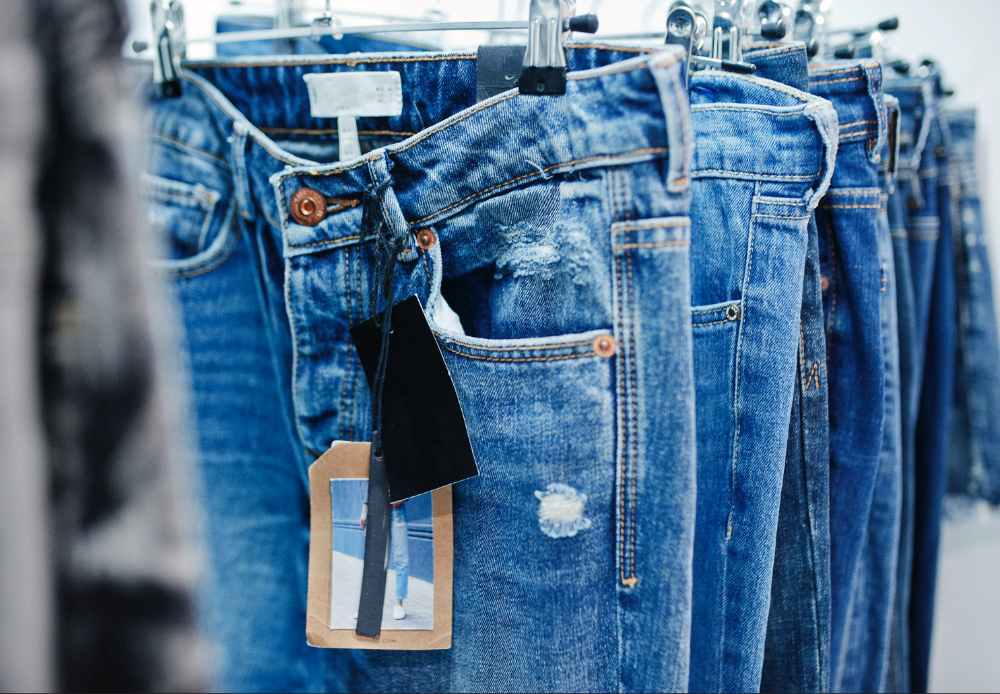

<h1 align="center">
  Trend Jeans - Projeto de Insights
</h1>

<h1 align="center">
  
</h1>

## 1. Problema de Negócio
    
Eduardo e Marcelo são dois brasileiros, amigos e sócios de empreendimento. Depois de vários negócios bem sucedidos, eles estão planejando entrar no mercado de moda dos USA como um modelo de negócio do tipo E-commerce.

### 1.1 Contexto de Negócio
A idéia inicial é entrar no mercado com apenas um produto e para um público específico, no caso o produto seria calças Jeans para o público masculino. O objetivo é manter o custo de operação baixo e escalar a medida que forem conseguindo clientes.

Porém, mesmo com o produto de entrada e a audiência definidos, os dois sócios não tem experiência nesse mercado de moda e portanto não sabem definir coisas básicas como preço, o tipo de calça e o material para a fabricação de cada peça

### 1.2 Questão de Negócio
   - Quantos tipos de calças e suas cores para o produto inicial?
   - Quais as matérias-prima necessárias para confeccionar as calças?
   - Qual o melhor preço de venda para as calças para bater o concorrente, incluindo preço do material e mão de obra de costura.
   - Calcular o lucro de cada peça, tirando o preço do material e mão de obra de costura.
   
   A principal concorrente da empresa Trend Jeans é a americana H&M.

## 2. Planejamento Prévio

### 2.1 Ferramentas
  - Python 3.8
  - Jupyter Notebook
  - BeautifulSoup
  - Sqlite3

## 3. Dados
Os dados para esse projeto foram coletados por web scraping no site da H&M e armazenados no banco Sqlite3: https://www2.hm.com/en_us/men/products/jeans.html

### 3.1 Atributos de origem

|    Atributos    |                         Definição                            |
| :-------------: | :----------------------------------------------------------: |
|   product_id    |                   Identificação do produto                   |
|    style_id     |                Identificação do estilo da calça              |
|    color_id     |                     Identificação da cor                     |
|  product_name   |                      Nome do produto                         |
|   color_name    |                        Nome da cor                           |
|      fit        |                      Modelo da calça                         |
|  product_price  |                     Preço do produto                         |
|   size_number   |                     Tamanho da calça                         |
|    size_model   |                     Altura do modelo                         |
|     cotton      |                 % de composição de algodão                   |
|    polyester    |                % de composição de polyester                  |
|     spandex     |                 % de composição de spandex                   |
| scrapy_datetime |                Data e hora do web scraping                   |
|   price_cotton  |                Calculo de preço do algodão                   |
| price_polyester |               Calculo de preço do polyester                  |
|  price_spandex  |                Calculo de preço do spandex                   |
|price_costureira |         Preço médio da hora de trabalho da costureira        |
|  total_price    |                        Preço total                           |
| dif_concorrente |              Diferença de preço do concorrente               |
|      lucro      |                          Lucro                               |
|  final_price    |                        Preço final                           |

## 4. Premissas

- Dados Removidos: 
    - Removemos as colunas size_number e size_model porque não são necessárias para essa primeira análise.

## 5. Respondendo as questões de negócio

   - **1:** Quantos tipos de calças e suas cores para o produto inicial?
   
      - A sugestão na escolha das cores para as calças, é escolher uma cor que aparece em todos os modelos de calças. Assim podemos economizar com o preço do tecido aproveitando eles para todos os tipos de calças.
      - As cores light_denim_blue, black, denim_blue e dark_denim_blue aparecem na maioria dos modelos de calça.
      
      - A sugestão para a escolha dos modelos é utilizar modelos que tenham as 4 cores que escolhemos na sugestão anterior.
        Então nesse caso vamos escolher apenas 2 modelos de jeans para iniciar o negócio.
        Modelos escolhidos:
        - slim_fit
        - skinny_fit

   - **2:** Quais as matérias-prima necessárias para confeccionar as calças?
   
      - Com base nos dados de calças coletados no site da H&M, as três principais matérias-prima utilizadas são: Algodão, Polyester e Spandex.

   - **3:** Qual o melhor preço de venda para as calças para bater o concorrente, incluindo preço do material e mão de obra de costura.
     
      - Fazendo uma pesquisa de preços no Google em fornecedores da China, chegamos aos seguintes preços para os tecidos:
        - Cotton m2: 1.15 - 1.6 USD
        - Polyester m2: 1.9 - 2.01 USD
        - Spandex m2: 1.95 - 2.15 USD
        
      - Pesquisando o salário médio de uma costureira nos Estados Unidos, chegamos no seguinte resultado:
        - Salário base médio 16,70 USD por hora.
      
      - Calculo preço dos materiais:
        - Pegar a porcentagem de material de cada peça e se for maior que 0.50, multiplicar pelo preço máximo por metro quadrado do material vezes dois, considerando que vamos utilizar dois metros quadrados para montar a peça.
        - Se for menor que 0.50, multiplicar pelo preço máximo por metro quadrado do material, considerando que vamos utilizar apenas um metro quadrado para montar a peça.
      
      - Calculo preço mão de obra:
        - Pegar o salário base médio de 16,70 USD por hora e acrescentar em cada calça, considerando que uma costureira faz uma calça por hora.
   
   - **4:** Calcular o lucro de cada peça, tirando o preço do material e mão de obra de costura
      
      - Calculo de lucro:
        - Ver quantas peças podemos ter lucro, subtraindo o preço do concorrente do total price.
        - Desconsideraremos peças que apresentarem valores negativos.
        - Vamos fabricar e vender as peças onde podemos obter o mesmo preço do concorrente com a mão de obra e lucro, dando 10% de desconto no preço      final dessa peça para batermos o preço do concorrente.
        

## 6. Resultados Financeiros 

Considerando todos os dados e cálculos realizados, conforme explicado nos tópicos anteriores:

|   Lucro com as vendas em cada calça podem variar de:   |
|--------------------------------------------------------|
|                    $ 3,74 a $ 22,04                    |

## 9. Próximos Passos

 Usar algoritmos de machine learning para recomendar o preço estimado de venda.
